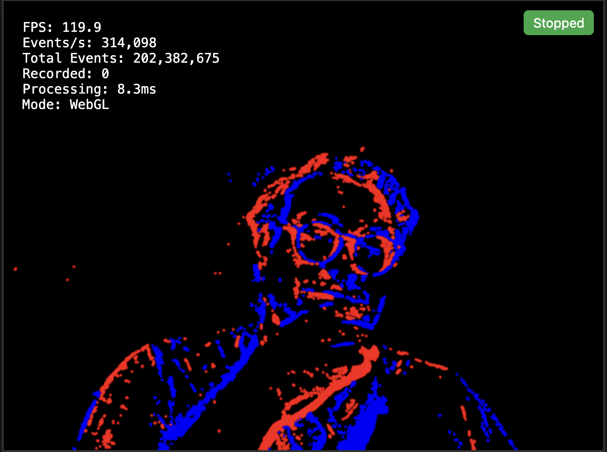
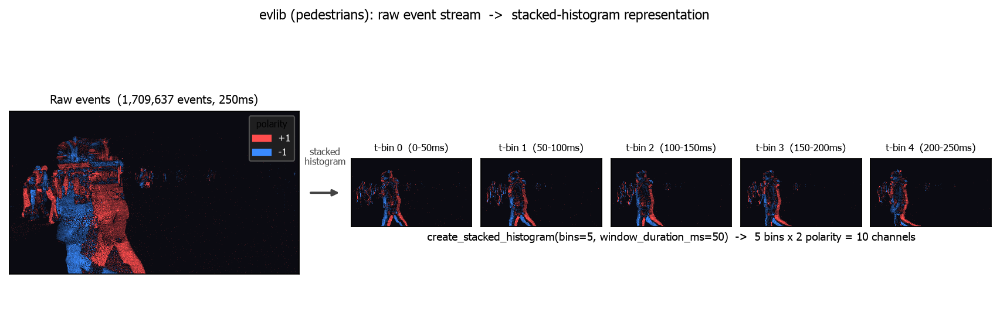

<table align="center">
  <tr>
    <td>
      
    </td>
    <td>
      <h1 style="margin: 0;">
        <code>evlib</code>: Event Camera Data Processing Library
      </h1>
    </td>
  </tr>
</table>

<div style="text-align: center;" align="center">

[](https://pypi.org/project/evlib/)
[](https://pypi.org/project/evlib/)
[](https://tallamjr.github.io/evlib/)
[](https://github.com/tallamjr/evlib/actions/workflows/pytest.yml)
[](https://github.com/tallamjr/evlib/actions/workflows/rust.yml)
[](https://github.com/tallamjr/evlib)
[](https://github.com/tallamjr/evlib/blob/master/LICENSE.md)

</div>

An event camera processing library with a Rust backend and Python bindings,
designed for scalable data processing with real-world event camera datasets.

### Architecture

evlib keeps a thin Rust core and does all DataFrame work in Polars from Python:

- **Rust** (`evlib._evlib`) handles only what cannot be expressed as DataFrame
  operations: binary format parsing (EVT2/EVT3/EVT2.1, AEDAT, AER, HDF5 with the
  ECF codec), construction of the Polars frame from decoded primitives, and the
  native dense scatter-add kernels that build RVT stacked-histogram
  representations (`evlib.representations_rs.stacked_histogram_dense` on the CPU,
  plus `_cuda` and `_metal` GPU kernels).
- **Python Polars** handles all processing: loading filters, filtering
  (`evlib.filtering`), and representations (`evlib.representations`, `evlib.rvt`).
  Every query is a lazy Polars `LazyFrame` collected with a selectable engine, so
  the same code runs on the CPU streaming engine today and on the GPU via
  cudf-polars (`collect(engine="gpu")`) where CUDA is available.

`evlib.load_events` returns a `LazyFrame` and applies any time, spatial, or
polarity filters as Polars expressions, so loading and filtering fuse into one
GPU-collectable query.

<!-- mtoc-start -->

- [Quick Start](#quick-start)
  - [What are Event Cameras?](#what-are-event-cameras)
  - [Basic Usage](#basic-usage)
  - [RVT preprocessing backends](#rvt-preprocessing-backends)
  - [Performance](#performance)
- [Installation](#installation)
- [Documentation](#documentation)
- [Examples](#examples)
- [Development](#development)
- [Community & Support](#community--support)
- [License](#license)

<!-- mtoc-end -->

## Quick Start


### What are Event Cameras?

Event cameras (also called neuromorphic or dynamic vision sensors) operate
asynchronously: each pixel independently reports brightness changes as they
occur, rather than sampling frames at a fixed rate.

Each **event** is represented as a 4-tuple:

$$e = (x, y, t, p)$$

Where:

- $x, y \in \mathbb{N}$: Pixel coordinates
- $t \in \mathbb{R}^+$: Timestamp (microsecond precision)
- $p \in \{-1, +1\}$ or $\{0, 1\}$: Polarity (brightness change direction)

An event fires when the logarithmic brightness change exceeds a threshold:

$$\log(L(x,y,t)) - \log(L(x,y,t_{\text{last}})) > \pm C$$

where $C$ is the contrast threshold. This yields microsecond temporal
resolution, 120 dB+ dynamic range, and data sparsity proportional to scene
motion.

For a deeper introduction, see the
[user guide](https://tallamjr.github.io/evlib/user-guide/loading-data/).

<p align="center">
  
</p>

### Basic Usage

```python
import evlib

# Automatic format detection: returns a Polars LazyFrame
events = evlib.load_events("data/prophesee/samples/evt2/80_balls.raw")

df = events.collect(engine="streaming")
print(f"Loaded {len(df):,} events")
print(f"Resolution: {df['x'].max()} x {df['y'].max()}")
print(f"Duration:   {df['t'].max() - df['t'].min()}")
```

Chain Polars expressions for efficient filtering and representation extraction:

```python notest
import evlib
import evlib.representations as evr
import polars as pl

events = evlib.load_events("data/prophesee/samples/hdf5/pedestrians.hdf5")

# Temporal + spatial + polarity filtering, lazily
filtered = events.filter(
    (pl.col("t").dt.total_microseconds() / 1_000_000).is_between(0.1, 0.5)
    & pl.col("x").is_between(100, 500)
    & (pl.col("polarity") == 1)
)

# Produce a stacked histogram ready for an RVT-style model
hist = evr.create_stacked_histogram(
    filtered.collect(),
    height=180, width=240,
    bins=5, window_duration_ms=50.0,
)
```

The transformation turns a raw asynchronous event stream into a dense,
model-ready tensor. Below, the `pedestrians` sequence: on the left, 250ms of raw
events (red `+1`, blue `-1`); on the right, the same window as a stacked
histogram of five 50ms temporal bins, where the walking figures advance bin to
bin:

<p align="center">
  
</p>

Both this and a fully reproducible `80_balls` version (from the tracked EVT2
sample) are generated by `python scripts/generate_representation_figures.py`.

See the [representations guide](https://tallamjr.github.io/evlib/user-guide/representations/)
for voxel grids, time surfaces, and mixed density stacks.

### RVT preprocessing backends

`evlib.rvt.process_sequence(...)` reproduces the RVT stacked-histogram
preprocessing pipeline and offers four interchangeable backends via `backend=`:

- `"polars"`: Polars on the CPU, or on the cudf GPU engine when you pass an
  `engine=` of `"gpu"` or a `pl.GPUEngine(...)`.
- `"rust"`: Rust dense scatter-add on the CPU.
- `"cuda"`: a custom CUDA scatter-add kernel on an NVIDIA GPU. It loads the
  nvcc-built `librvt_scatter.so` via the `EVLIB_CUDA_LIB` environment variable.
- `"metal"`: a Metal scatter-add kernel on Apple Silicon. Build it with
  `CC=clang maturin develop --features metal`.

The underlying native kernels are exposed directly as
`evlib.representations_rs.stacked_histogram_dense` (CPU),
`stacked_histogram_dense_cuda`, and `stacked_histogram_dense_metal`.

### Performance

evlib is bit-validated against the reference implementations it competes with:
RVT (PyTorch), tonic, OpenEB, and dv_processing. On the gen4_1mpx validation set
(18 sequences, RTX 4090), the RVT preprocessing output matches RVT torch
exactly bar a single roughly 1e-10 boundary quirk, and the timings are:

- evlib CUDA: 283.6s, slightly ahead of RVT torch-GPU at 286.3s (parity-plus,
  about 1.01x).
- evlib Rust-CPU: 406.2s, 1.32x faster than RVT torch-CPU at 534.2s.
- evlib CUDA is 1.88x faster than RVT torch-CPU.

For the standalone representations (20M events, versus tonic NumPy): voxel_grid
1.35x, event_frame 2.9x, time_surface 2.1x.

The Polars GPU engine is not a free win for single operations, and the
CUDA-versus-RVT-GPU margin is parity-plus rather than a large speedup. The biggest
margins are evlib's CPU backends and the standalone representations.

> [!Note]
>
> **State of the GPU and Metal work**: the CUDA backend is the production GPU path and edges out RVT's torch-GPU pipeline. The Metal backend matches the CPU kernel exactly on an M2 Pro, but about 3x slower there: the workload is memory-bound and the M2 Pro's CPU cores win. Metal is a portability path (an on-device kernel where torch-CUDA cannot run), not a speed win on M2-class hardware; use `backend="rust"` for the fastest Apple-CPU path.

<p align="center">
  
</p>

More plots: the full five-backend chart
[`rvt_final_time.png`](./benchmarks/out/rvt_final_time.png) (and
[`rvt_final_memory.png`](./benchmarks/out/rvt_final_memory.png) for peak memory),
plus [`tonic_bench_time.png`](./benchmarks/out/tonic_bench_time.png) for the
representations-versus-tonic comparison.

**Full documentation:** <https://tallamjr.github.io/evlib/>

## Installation

```bash
# Basic install
pip install evlib

# With PyTorch integration
pip install evlib[pytorch]
```

From source (requires Rust nightly and `maturin`):

```bash
git clone https://github.com/tallamjr/evlib.git
cd evlib
uv venv --python 3.12 && source .venv/bin/activate
uv pip install -e ".[dev]"
maturin develop                    # default minimal build
maturin develop --features hdf5    # opt-in HDF5 support (Linux/macOS)
```

> [!Warning]
>
> **Known issue: `--features hdf5` fails against Homebrew HDF5 2.x.** The Rust
> binding (`hdf5-metno-sys 0.10.1`) only supports HDF5 1.8/1.10/1.12/1.14 and
> panics on a 2.x header with `Invalid H5_VERSION: "2.1.1"`. Homebrew now ships
> 2.x, and even its `hdf5@1.14` formula currently resolves to 2.1.1, so there is
> no Homebrew-based fix. To build the feature, point `HDF5_DIR` at a genuine
> 1.8-1.14 install from another source, for example conda-forge:
>
> ```bash
> conda install -c conda-forge "hdf5=1.14"
> HDF5_DIR="$CONDA_PREFIX" maturin develop --features hdf5
> ```
>
> The default build (no `--features hdf5`) is unaffected: read HDF5 via `h5py`,
> or use the EVT2/EVT3 readers (which need no HDF5 feature). On Windows, HDF5 is
> always read through `h5py`.

Distributable wheels are built with the opt-in `extension-module` feature, e.g.
`maturin build --release --features python,polars,arrow,extension-module`. That
feature is deliberately off by default so `cargo test` and `maturin develop`
build and run without linking errors.

GPU scatter-add kernels are opt-in features. For the CUDA backend, build the
nvcc kernel and point `EVLIB_CUDA_LIB` at the resulting `librvt_scatter.so`. For
the Metal backend on Apple Silicon, build with
`CC=clang maturin develop --features metal`.

HDF5 is opt-in on Linux/macOS and unavailable on Windows; use `h5py` directly
for HDF5 I/O on Windows. Full details and platform-specific notes live in
the [installation guide](https://tallamjr.github.io/evlib/getting-started/installation/).

## Documentation

Complete documentation is published at <https://tallamjr.github.io/evlib/>:

- [Quick Start](https://tallamjr.github.io/evlib/getting-started/quickstart/)
- [Loading Data](https://tallamjr.github.io/evlib/user-guide/loading-data/): formats, polarity encoding, streaming
- [Event Representations](https://tallamjr.github.io/evlib/user-guide/representations/)
- [Polars Preprocessing](https://tallamjr.github.io/evlib/user-guide/polars-preprocessing/)
- [Performance Guide](https://tallamjr.github.io/evlib/getting-started/performance/): benchmarks, memory monitoring, troubleshooting
- [API Reference](https://tallamjr.github.io/evlib/api/core/)
- [Platform Support](https://tallamjr.github.io/evlib/platform-support/windows/)

## Examples

Runnable examples live in [`examples/`](./examples):

```bash
python examples/simple_example.py
python examples/filtering_demo.py
python examples/stacked_histogram_demo.py

# Jupyter notebooks
pytest --nbmake examples/
```

Benchmarks live in [`benchmarks/`](./benchmarks): the Python suite (`bench_rvt_dataset.py`, `bench_tonic.py`) at the top level, and the Rust criterion benches under [`benchmarks/rust/`](./benchmarks/rust).

## Development

```bash
# Tests (both run directly, no special flags needed)
pytest                        # Python (test suite only)
cargo test                    # Rust
pytest --markdown-docs docs/  # doc examples (explicit)
pytest --nbmake examples/     # example notebooks (explicit)

# Formatting / linting
black python/ tests/ examples/
cargo fmt
ruff check python/ tests/
cargo clippy -- -D warnings
```

See [CONTRIBUTING](./docs/development/contributing.md) and the
[architecture overview](./docs/development/architecture.md) for design details.

## Community & Support

- [**Issues**](https://github.com/tallamjr/evlib/issues): Report bugs and request features


## License

MIT License. See [LICENSE.md](LICENSE.md) for details.
