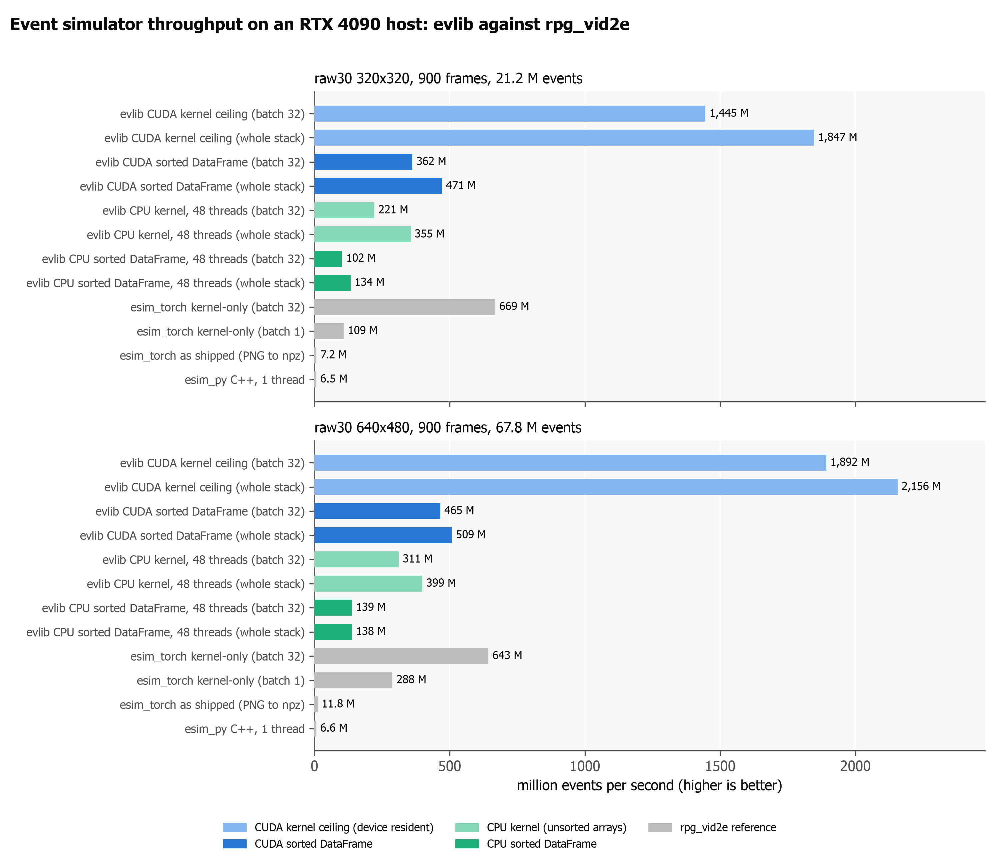
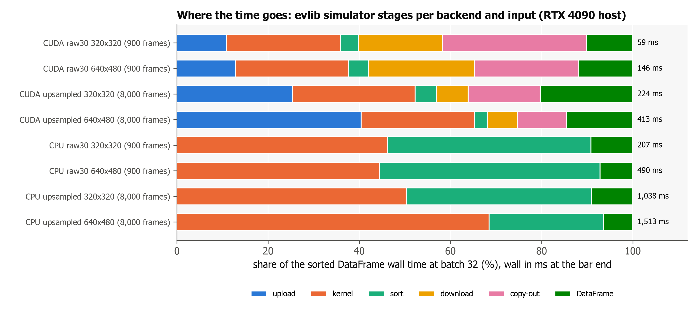
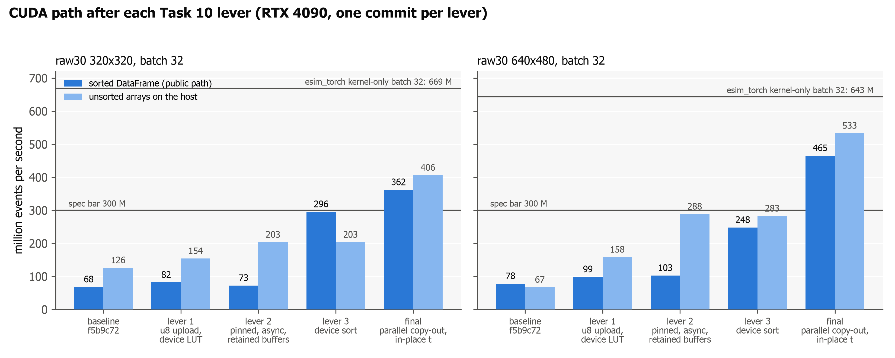

# evlib vs RVT preprocessing benchmark

This benchmark compares evlib's RVT-preprocessing pipeline against RVT's own torch
implementation on the same task: turning the raw Gen4 1Mpx validation recording
(`moorea_2019-02-21_000_td_2257500000_2317500000`, roughly 540 million events) into the
stacked-histogram event representation used by RVT.

Run it with:

```bash
.venv/bin/python -m benchmarks.bench_rvt_pipeline --repeats 3
```

## What is compared

Four pipeline variants, all producing the same output tensor of shape
`(1198, 20, 360, 640)` in `uint8`:

1. **evlib rust (dense scatter-add)**: `evlib.rvt.process_sequence(backend="rust")`. Reads
   the raw h5 directly (no Parquet conversion), corrects time to non-decreasing, computes
   per-window slices with `np.searchsorted`, and hands each batch of windows to a Rust
   function that scatter-adds event counts straight into a preallocated dense buffer per
   window (the analogue of torch's `tensor.put_(accumulate=True)`), clips each pixel to the
   count cutoff and casts to `uint8`. This is the fast path.
2. **evlib streaming (full)**: `evlib.rvt.process_sequence(engine="streaming")`, the default
   Polars backend. This is the real end-to-end pipeline. It includes evlib's one-time
   conversion of the raw h5 into a sorted Parquet file, then the windowed Polars build of
   the representation.
3. **evlib build only**: the same Polars build path, but reading from a pre-built Parquet
   so the one-time h5 to Parquet conversion is excluded. This isolates the per-run build
   cost from the conversion that only needs to happen once per recording.
4. **RVT torch (reference)**: RVT's genuine code, reusing the modules under `lib/RVT`
   (`H5Reader` with its numba cum-max time correction, `StackedHistogram` with
   `count_cutoff=10, fastmode=True`, and `downsample_ev_repr` nearest-exact 0.5). RVT
   reads slices straight from the raw h5 and builds dense torch tensors per window.

## Methodology

- **Same raw input** for all variants: the committed Gen4 val h5.
- **Same reference grid**: every variant windows over the committed reference
  `timestamps_us.npy` (1198 window-end timestamps), so the windowing is the same. The
  RVT reference is fed this grid directly rather than recomputing it from labels, which
  is the only adaptation made to its code.
- **Bit-identical outputs verified**: before any timing, each variant is run once and its
  output asserted `np.array_equal` to the committed reference output across all 1198
  windows. The run aborts if any variant diverges from the reference, so we never benchmark a
  broken build. All four variants pass.
- **Timing**: each variant runs in a fresh subprocess, `--repeats 3` times. The bar shows
  the median with min..max error bars. The reported time is the pipeline body wall-clock
  (excluding interpreter and import start-up, which is the same across variants).
- **Peak memory**: each subprocess reports its own peak resident set size via
  `resource.getrusage(RUSAGE_SELF).ru_maxrss`, normalised to bytes per platform (bytes on
  macOS, KiB on Linux). This captures native Polars and torch buffers that `tracemalloc`
  would miss.

## Headline numbers

Measured on this machine (macOS, CPU), medians over 3 repeats:

| pipeline | median time | peak memory |
| --- | --- | --- |
| evlib rust (dense scatter-add, raw h5) | 15.7 s | 6.34 GB |
| evlib streaming (full) | 58.5 s | 4.29 GB |
| evlib build only | 28.2 s | 3.28 GB |
| RVT torch (reference) | 23.4 s | 6.40 GB |

- **Time**: the **Rust dense scatter-add backend is about 1.5x faster than RVT's torch
  reference** (15.7 s vs 23.4 s median) on CPU, and roughly 3.7x faster than the full
  Polars streaming pipeline. It wins by skipping the h5 to Parquet conversion entirely
  (it reads the raw h5 directly) and by replacing the Polars hash group-by with a flat
  scatter-add into a preallocated dense buffer, which is the same algorithm torch uses but
  without torch's per-window tensor allocation overhead.
- **Memory**: the Rust backend also edges out RVT, using **slightly less** peak memory
  (6.34 GB vs 6.40 GB). It holds one uint32 copy of the global corrected time array
  (~2.16 GB for 540 M events, the raw h5 dtype) for the global `searchsorted`, which is the
  dominant fixed cost and matches RVT's own time-array footprint; the per-batch event slices
  and dense output buffers are small and do not grow with sequence length, so memory is
  bounded. So the Rust backend wins on both time and memory. The Polars backends use about
  1.5x less peak memory still (4.29 GB full, 3.28 GB build-only) by streaming windowed
  Parquet batches, at the cost of being slower.
- The default backend remains the Polars streaming path; the Rust scatter-add backend is
  opt-in via `backend="rust"`.

See `out/rvt_pipeline_time.png` and `out/rvt_pipeline_memory.png` for the charts, and
`out/rvt_pipeline_bench.md` for the regenerated min/median/max table.

## GPU note

evlib's build path also accepts `engine="streaming"` backed by the cudf-polars GPU
engine. That GPU path is coded but is validated separately on CUDA hardware; the numbers
above are CPU-only. The expectation is that the GPU engine shifts the time comparison in
evlib's favour, but that claim is deliberately left unmade here until it is measured on
CUDA.

## Event simulator benchmark

`evlib.simulation` (the ESIM kernel, CPU and CUDA backends) against rpg_vid2e's
`esim_torch` and `esim_py` on the same frames and host. All numbers below come from
`out/simulation_bench_results.json` (evlib, measured 2026-08-17 at commit `38afbde`) and
`out/simulation_reference_vid2e.json` (rpg_vid2e commit `ecbb11a`, measured 2026-08-16).
Host arg1: AMD Ryzen Threadripper 7960X (24 cores, 48 threads), NVIDIA RTX 4090 24 GB,
CUDA 12.9. Nothing is estimated.

### Method

- Input: Big Buck Bunny (Blender Foundation, CC BY 3.0), 900 frames from 00:05:40
  declared as 30 fps (29.97 s of video), greyscale PNG at 320x320 and 640x480 ("raw30"),
  plus the first 8,000 frames of the FILM-upsampled sequence ("upsampled", 16.73 s and
  10.61 s of video). Thresholds 0.2/0.2, refractory 0, uint8 frames through the log LUT.
- Driver: `benchmarks/bench_simulation.py`. Frames load once; one persistent
  `ESIMSimulator` runs the stack in slices of 32, 256 or all frames, so every mode gives the
  same event count (the driver asserts it). Median of 3 runs after one warm-up. The CPU
  used 48 threads (rayon default); glibc default allocator.
- Three throughput numbers per row. **kernel**: `EventSimulator.run(sort=False)`, unsorted
  raw arrays on the host. **sorted DataFrame**: `ESIMSimulator.simulate`, the public path
  (time-sorted Polars DataFrame). **device** (CUDA only): the kernel ceiling, frames already
  on the device and events left there, the sum of the count, scan, write and decode CUDA
  event times through the `libevsim.so` C ABI (`--stages`); this is the number comparable
  with esim_torch kernel-only. events/s = events / seconds; video-hours per GPU-day =
  24 * video seconds / wall seconds.
- Reference rows (`simulation_reference_vid2e.json`): esim_torch kernel-only times
  `esim.forward()` on GPU-resident frames with no sort and no copy back (median of 5 on
  raw30, 3 on upsampled); esim_torch as shipped is `generate_events.py`, PNG in, npz out,
  one run; esim_py is the C++ CPU binding, one thread, PNG in, one run.

### Results



| input | backend | batch | events | kernel s | events/s (kernel) | wall s | events/s (sorted DataFrame) | events/s (device) | video-hours per GPU-day |
|---|---|---|---|---|---|---|---|---|---|
| raw30 320x320 (900 frames, 29.97 s) | CPU | 32 | 21,212,272 | 0.096 | 221 M | 0.207 | 102 M |  | 3,469 |
| raw30 320x320 (900 frames, 29.97 s) | CPU | 256 | 21,212,272 | 0.047 | 451 M | 0.163 | 130 M |  | 4,422 |
| raw30 320x320 (900 frames, 29.97 s) | CPU | whole | 21,212,272 | 0.060 | 355 M | 0.159 | 134 M |  | 4,528 |
| raw30 320x320 (900 frames, 29.97 s) | CUDA | 32 | 21,212,272 | 0.052 | 406 M | 0.059 | 362 M | 1,445 M | 12,273 |
| raw30 320x320 (900 frames, 29.97 s) | CUDA | 256 | 21,212,272 | 0.036 | 581 M | 0.045 | 476 M | 1,718 M | 16,148 |
| raw30 320x320 (900 frames, 29.97 s) | CUDA | whole | 21,212,272 | 0.036 | 585 M | 0.045 | 471 M | 1,847 M | 15,982 |
| raw30 640x480 (900 frames, 29.97 s) | CPU | 32 | 67,819,884 | 0.218 | 311 M | 0.490 | 139 M |  | 1,469 |
| raw30 640x480 (900 frames, 29.97 s) | CPU | 256 | 67,819,884 | 0.127 | 534 M | 0.463 | 147 M |  | 1,554 |
| raw30 640x480 (900 frames, 29.97 s) | CPU | whole | 67,819,884 | 0.170 | 399 M | 0.490 | 138 M |  | 1,468 |
| raw30 640x480 (900 frames, 29.97 s) | CUDA | 32 | 67,819,884 | 0.127 | 533 M | 0.146 | 465 M | 1,892 M | 4,935 |
| raw30 640x480 (900 frames, 29.97 s) | CUDA | 256 | 67,819,884 | 0.111 | 613 M | 0.136 | 500 M | 2,083 M | 5,302 |
| raw30 640x480 (900 frames, 29.97 s) | CUDA | whole | 67,819,884 | 0.112 | 603 M | 0.133 | 509 M | 2,156 M | 5,393 |
| upsampled 320x320 (8,000 frames, 16.73 s) | CPU | 32 | 26,568,646 | 0.522 | 51 M | 1.038 | 26 M |  | 387 |
| upsampled 320x320 (8,000 frames, 16.73 s) | CPU | 256 | 26,568,646 | 0.312 | 85 M | 0.414 | 64 M |  | 970 |
| upsampled 320x320 (8,000 frames, 16.73 s) | CPU | whole | 26,568,646 | 0.212 | 125 M | 0.338 | 79 M |  | 1,189 |
| upsampled 320x320 (8,000 frames, 16.73 s) | CUDA | 32 | 26,568,646 | 0.170 | 157 M | 0.224 | 118 M | 439 M | 1,790 |
| upsampled 320x320 (8,000 frames, 16.73 s) | CUDA | 256 | 26,568,646 | 0.124 | 213 M | 0.145 | 183 M | 521 M | 2,768 |
| upsampled 320x320 (8,000 frames, 16.73 s) | CUDA | whole | 26,568,646 | 0.115 | 231 M | 0.123 | 216 M | 657 M | 3,260 |
| upsampled 640x480 (8,000 frames, 10.61 s) | CPU | 32 | 50,453,777 | 1.036 | 49 M | 1.513 | 33 M |  | 168 |
| upsampled 640x480 (8,000 frames, 10.61 s) | CPU | 256 | 50,453,777 | 0.599 | 84 M | 0.839 | 60 M |  | 304 |
| upsampled 640x480 (8,000 frames, 10.61 s) | CPU | whole | 50,453,777 | 0.552 | 91 M | 0.805 | 63 M |  | 316 |
| upsampled 640x480 (8,000 frames, 10.61 s) | CUDA | 32 | 50,453,777 | 0.337 | 150 M | 0.413 | 122 M | 491 M | 616 |
| upsampled 640x480 (8,000 frames, 10.61 s) | CUDA | 256 | 50,453,777 | 0.277 | 182 M | 0.304 | 166 M | 538 M | 836 |
| upsampled 640x480 (8,000 frames, 10.61 s) | CUDA | whole | 50,453,777 | 0.279 | 181 M | 0.297 | 170 M | 626 M | 858 |

Reference rows from rpg_vid2e on the same host and frames:

| system | input | batch | events | wall s | events/s | video-hours per GPU-day |
|---|---|---|---|---|---|---|
| esim_torch kernel-only | raw30 320x320 (900 frames) | 1 | 21,285,567 | 0.196 | 108.5 M | 3,667 |
| esim_torch kernel-only | raw30 320x320 (900 frames) | 32 | 21,285,567 | 0.032 | 668.5 M | 22,589 |
| esim_torch as shipped | raw30 320x320 (900 frames) | 1 | 21,285,567 | 2.961 | 7.2 M | 243 |
| esim_py | raw30 320x320 (900 frames) |  | 21,326,515 | 3.260 | 6.5 M | 221 |
| esim_torch kernel-only | raw30 640x480 (900 frames) | 1 | 68,051,797 | 0.236 | 288.4 M | 3,048 |
| esim_torch kernel-only | raw30 640x480 (900 frames) | 32 | 68,051,797 | 0.106 | 643.1 M | 6,796 |
| esim_torch as shipped | raw30 640x480 (900 frames) | 1 | 68,051,797 | 5.744 | 11.8 M | 125 |
| esim_py | raw30 640x480 (900 frames) |  | 68,193,660 | 10.300 | 6.6 M | 70 |
| esim_torch kernel-only | upsampled 320x320 (8,000 frames) | 1 | 26,710,202 | 1.551 | 17.2 M | 259 |
| esim_torch kernel-only | upsampled 320x320 (8,000 frames) | 32 | 26,710,202 | 0.078 | 342.8 M | 5,155 |
| esim_torch as shipped | upsampled 320x320 (11,553 frames) | 1 | 31,469,856 | 15.773 | 2.0 M | 46 |
| esim_py | upsampled 320x320 (11,553 frames) |  | 31,502,024 | 17.834 | 1.8 M | 40 |
| esim_torch kernel-only | upsampled 640x480 (8,000 frames) | 1 | 50,810,236 | 1.677 | 30.3 M | 152 |
| esim_torch kernel-only | upsampled 640x480 (8,000 frames) | 32 | 50,810,236 | 0.155 | 328.5 M | 1,646 |
| esim_torch as shipped | upsampled 640x480 (17,961 frames) | 1 | 105,845,660 | 44.938 | 2.4 M | 16 |
| esim_py | upsampled 640x480 (17,961 frames) |  | 105,954,196 | 71.256 | 1.5 M | 10 |

Read as: on the raw frames the evlib CUDA kernel ceiling (1,445 M and 1,892 M events/s
at batch 32) is 2.2x and 2.9x esim_torch kernel-only at the same batch (668.5 M and
643.1 M), and the sorted DataFrame a user gets back (362 M and 465 M events/s at batch 32)
is above the 300 M bar and 39x to 50x the shipped esim_torch script (7.2 M and 11.8 M). The
CPU path on 48 threads gives 130 M to 147 M events/s as a sorted DataFrame at batch 256,
20x to 22x esim_py on one thread (6.5 M and 6.6 M). esim_torch and evlib count events within
0.34 % on raw30 and 0.70 % on the upsampled frames (float32 tie resolution, see the
conformance test). On the upsampled inputs the CUDA path is bound by the frame upload
(0.8 GB and 2.4 GB of uint8 frames per stack) and stays at 118 M to 216 M events/s.

### Where the time goes



Stages at batch 32 as a share of the sorted DataFrame wall. CPU rows: kernel
(`kernel_s`), sort (`sort_s`, host bucket sort), DataFrame (`df_s`). CUDA rows, from the
`stages_sorted` block of the JSON: upload (copy into pinned memory plus H2D), kernel
(count + scan + write + decode on the device), sort (device radix sort), download (D2H
of the sorted columns), copy-out (the rest of `sorted_s`: the copy from pinned memory
into fresh host arrays and its page faults), DataFrame (`df_s`). On the raw frames the
device kernel is 25 % of the CUDA wall; transfers and the host copy-out are the larger
part.

### CUDA path per lever



The `cuda_levers` block of the JSON holds the same raw30 runs after each Task 10 commit
(batch 32, sorted DataFrame events/s at 320x320 / 640x480): baseline `f5b9c72` 68 M /
78 M; lever 1 `bee402b` (uint8 upload, log LUT on the device) 82 M / 99 M; lever 2
`cd3e462` (pinned staging, async copies, retained device buffers) 73 M / 103 M; lever 3
`8a327f9` (device radix sort) 296 M / 248 M; final `38afbde` (parallel copy-out, in-place
DataFrame time conversion) 362 M / 465 M.

### Reproduce

The frame folders are not tracked (Big Buck Bunny is 725 MB); prepare them as in
`lib/research/2026-08-16-rpg-vid2e-4090-benchmark.md` (ffmpeg centre crop to greyscale
PNG, `timestamps.txt` in seconds, `imgs/*.png`). Then, on a CUDA host with the kernel
built (`scripts/build_cuda_kernels.sh` and `EVLIB_CUDA_SIM_LIB` set):

```bash
.venv/bin/maturin develop --release --features cuda
.venv/bin/python -m benchmarks.bench_simulation --frames-dir ~/vid2e-bench/raw30/320x320/seq \
    --backend cpu,cuda --batches 32,256,all --stages --out benchmarks/out/evlib_raw30_320x320.json
.venv/bin/python -m benchmarks.plot_simulation   # figures from the committed JSON, no GPU needed
```

Reference source: rpg_vid2e (github.com/uzh-rpg/rpg_vid2e, GPL-3.0) commit
`ecbb11a9345bb9d31b4b691e7d82965da4401345`, measured 2026-08-16. Input video: Big Buck
Bunny, Blender Foundation, CC BY 3.0 (www.bigbuckbunny.org).
