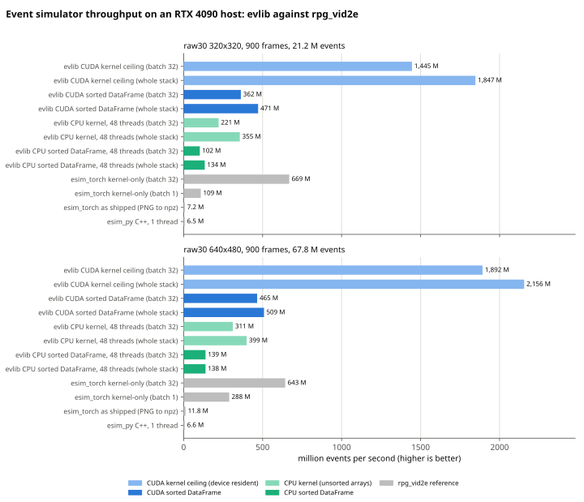
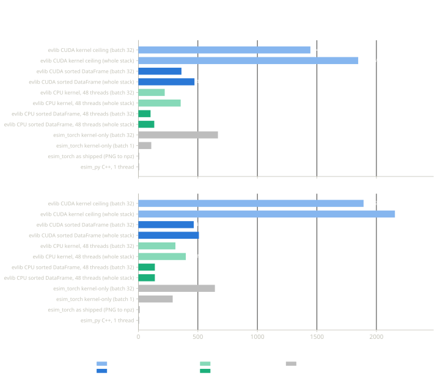

# Simulation API Reference

`evlib.simulation` turns intensity frames into events with the ESIM threshold-crossing model. The kernel is Rust (`src/ev_simulation/`, exposed as `evlib.simulation_rs`), runs rows-parallel on the CPU with rayon or on an NVIDIA GPU through a runtime-loaded CUDA library, and returns Polars DataFrames in the evlib schema. It needs no PyTorch.

## The model

1. Each frame is converted to log intensity: `L = ln(I / 255 + log_eps)` (uint8 input) or taken as-is (float32 input).
2. Every pixel keeps a reference level `l_ref` (set from the first frame) and the time of its last event.
3. Between two frames the log intensity is interpolated linearly in time; each crossing of `l_ref + c_pos` (or `l_ref - c_neg`) emits one event of polarity `+1` (or `-1`) at the crossing time and moves `l_ref` to the crossed level.
4. Crossing times are floored to whole nanoseconds; an event inside the refractory period of the pixel is dropped but still moves `l_ref`.
5. `threshold_sigma > 0` draws per-pixel thresholds from a normal distribution around `c_pos` and `c_neg` with a fixed `seed`, so runs are reproducible.

## `simulate_frames`

```text
def simulate_frames(frames, timestamps_ns, config=None, sort=True) -> pl.DataFrame
```

`frames` is a `(T, H, W)` array, `uint8` intensity or `float32` log intensity; `timestamps_ns` is `int64` nanoseconds, strictly increasing. The result has columns `x` Int16, `y` Int16, `t` Duration(us) and `polarity` Int8, sorted by `t` unless `sort=False`. With `sort=False` (and for `ESIMSimulator.step_ns`) events are grouped by row chunk and the order is not stable across thread counts. The first frame only initialises the state, so it emits no events.

```python
import numpy as np
from PIL import Image
from evlib.simulation import ESIMConfig, simulate_frames

root = "data/slider_depth"
frames, t_ns = [], []
for line in open(f"{root}/images.txt"):
    secs, rel = line.split()
    frames.append(np.asarray(Image.open(f"{root}/{rel}").convert("L")))
    t_ns.append(round(float(secs) * 1e9))
frames = np.stack(frames)                       # (87, 180, 240) uint8
t_ns = np.asarray(t_ns, dtype=np.int64)

config = ESIMConfig(positive_threshold=0.2, negative_threshold=0.2, device="cpu")
events = simulate_frames(frames, t_ns, config)  # 6,650,175 events, sorted by t
print(events.schema)
```

`ESIMConfig` fields: `positive_threshold=0.2`, `negative_threshold=0.2`, `refractory_period_ms=0.0`, `log_eps=1e-3`, `threshold_sigma=0.0`, `seed=0`, `device="auto"`. Presets are in `ESIM_CONFIGS` (`default`, `high_sensitivity`, `low_sensitivity`, `low_noise`, `mismatch`) via `get_esim_config(name)`.

## `ESIMSimulator`

A stateful simulator for streaming input. `process_frame(frame, seconds)` takes one `(H, W)` grey or `(H, W, 3)` RGB uint8 frame (BT.601 luma) or a float32 log frame and returns `(x, y, t_s, p)` NumPy arrays; `step_ns(frame, t_ns)` is the raw form; `simulate(frames, timestamps_ns, sort=True)` feeds a whole `(T, H, W)` slice and returns a DataFrame. State carries over between calls, so slices give the same events as one `simulate_frames` call. `reset()` clears the state; `thresholds()` returns the per-pixel `(c_pos, c_neg)` maps; `device` reports the resolved backend.

```python
import numpy as np
import polars as pl
from PIL import Image
from evlib.simulation import ESIMConfig, ESIMSimulator

root = "data/slider_depth"
lines = [line.split() for line in open(f"{root}/images.txt")]

sim = ESIMSimulator(ESIMConfig(), width=240, height=180)
for secs, rel in lines[:20]:
    frame = np.asarray(Image.open(f"{root}/{rel}").convert("L"))
    x, y, t_s, p = sim.process_frame(frame, float(secs))   # first call only initialises

# Batches keep the state too: slices give the same events as one call.
frames = np.stack([np.asarray(Image.open(f"{root}/{rel}").convert("L")) for _, rel in lines])
t_ns = np.asarray([round(float(secs) * 1e9) for secs, _ in lines], dtype=np.int64)
sim.reset()
chunks = [sim.simulate(frames[a:a + 32], t_ns[a:a + 32]) for a in range(0, len(frames), 32)]
events = pl.concat(chunks)                      # 6,650,175 events, same as simulate_frames
```

## `VideoToEvents`

`VideoToEvents(esim_config, video_config)` decodes a video file with OpenCV (`pip install evlib[plot]`) and simulates it: `process_video(path)` returns one DataFrame (chunked internally for long clips), `process_frames_streaming(path, chunk_frames=64)` yields one DataFrame per chunk with the state kept between chunks, and `get_video_info(path)` reports the source properties. `VideoConfig` sets `width`, `height`, `fps`, `start_time`, `end_time`, `frame_skip` and `grayscale`. `evlib.simulation.video_to_events(path, esim_config, video_config)` is the one-call form.

## Front end

evlib takes frames plus timestamps. Frame interpolation and video decode for VID2E-style upsampling (FILM, SuperSloMo, adaptive bisection) live outside evlib; the [lumin](https://github.com/tallamjr/lumin) front end produces the upsampled frame stacks and hands them to `simulate_frames`.

### Frame stacks from lumin vfi

`evlib.simulation.load_frame_stack(path)` reads a stack directory written by lumin's `StackWriter`: `frames.u8` (T\*H\*W bytes, frame-major, row-major uint8), `timestamps_ns.i64` (T little-endian int64) and `meta.json` (`width`, `height`, `frames`, `source`, `source_fps`, `model`, `provider`, `policy`, `factor`, `generated_by`, `date`). It returns a `FrameStack` dataclass with `frames` (a read-only `(T, H, W)` uint8 `numpy.memmap`), `timestamps_ns` (an int64 array) and `meta` (the parsed `meta.json` dict). It raises `FileNotFoundError` if a file is missing and `ValueError` if the file sizes do not match `meta.json` or the timestamps are not strictly increasing.

```python
from evlib.simulation import ESIMConfig, load_frame_stack, simulate_frames

stack = load_frame_stack("seq/")             # frames.u8, timestamps_ns.i64, meta.json
events = simulate_frames(stack.frames, stack.timestamps_ns, ESIMConfig())
```

`stack.frames` is memory-mapped, so `simulate_frames` and `ESIMSimulator.simulate` can take it directly without loading the whole stack into memory. For a stack too large to hold as one batch, `scripts/esim_convert.py --frames-dir seq/ --output events.parquet --batch-frames 256` feeds it through a persistent `ESIMSimulator` in slices, matching the events of a single whole-stack call while keeping memory bounded.

## Devices and the CUDA build

`ESIMConfig(device=...)` selects the backend: `"cpu"` (rayon over rows, all cores), `"cuda"`, or `"auto"` (CUDA when available, else CPU). `evlib.simulation_rs.cuda_available()` reports whether the CUDA backend can run. Both backends use float32 state and float64 crossing times and give bit-identical event sets; `tests/test_simulation_cuda.py` checks that on the slider_depth frames.

The CUDA backend is a runtime-loaded shared library, so the default wheel has no CUDA dependency:

```bash
# Build the kernel (nvcc on PATH or NVCC=/path/to/nvcc; arch defaults to native)
scripts/build_cuda_kernels.sh target/cuda sm_89
export EVLIB_CUDA_SIM_LIB=$PWD/target/cuda/libevsim.so

# Build evlib with the loader
maturin develop --release --features cuda
python -c "import evlib; print(evlib.simulation_rs.cuda_available())"   # True
```

`EVLIB_CUDA_SIM_LIB` defaults to `libevsim.so` on the loader path. Requesting `device="cuda"` without the backend raises `RuntimeError`.

How the CUDA path runs a batch: uint8 frames are copied into a pinned staging buffer and uploaded as bytes (the log LUT is applied on the device; float32 log frames are uploaded as they are), one thread per pixel counts events, a scan gives per-pixel offsets, a second pass writes the events, and with `sort=True` the batch is sorted by time on the device (radix sort on the 64-bit timestamp, stable for equal timestamps) before the columns are copied back through pinned memory. Device and pinned buffers are owned by the simulator and grow geometrically, so there is no per-call allocation on the device. Feeding 32 frames per call is enough to reach the numbers below; larger batches gain a little more.

## Conformance with rpg_vid2e

`tests/test_vid2e_conformance.py` compares the kernel with `esim_torch` from [rpg_vid2e](https://github.com/uzh-rpg/rpg_vid2e) (commit `ecbb11a`) on the 87 slider_depth frames at thresholds 0.2/0.2, against tracked reference digests. Measured on 2026-08-16: total and positive event counts agree within 0.121 % and 0.120 % (bar 0.25 %); per-frame counts within 0.75 % max; 10x10 block counts within 1.64 % max; the first 200 events sorted by `(t, y, x, p)` have identical `x`, `y`, `p` and `t` within 1 ns. The residual comes from exact ties: a uint8 pixel that returns to a grey level seen before makes `L1` equal `l_ref + k*c` exactly, and float32 rounding resolves the tie differently in the two kernels (98.4 % of the divergent pixel cells). esim_torch also computes event times in float32, so timestamps are only compared on the early sample where one float32 ulp is below 1 ns.

## Benchmark

The kernel is fast enough that Python and I/O set the ceiling for most workloads, not the simulation itself. Measured 2026-08-17 on an RTX 4090 host, real video frames, thresholds 0.2/0.2.

"Events per second" below is what you actually get back from `simulate_frames`: sorted, in a Polars DataFrame.

| resolution | CPU (48 threads) | CUDA | vs rpg_vid2e's shipped script |
|---|---|---|---|
| 320x320 | 130 M events/s | 362 M events/s | 18x (CPU), 50x (CUDA) |
| 640x480 | 147 M events/s | 465 M events/s | 12x (CPU), 39x (CUDA) |

<figure markdown="span">
    { width="900" }
    { width="900" }
    <figcaption>Million events per second on the raw30 frames; every bar is a row of <code>benchmarks/out/simulation_bench_results.json</code> or <code>simulation_reference_vid2e.json</code>. Regenerate with <code>python -m benchmarks.plot_simulation</code>.</figcaption>
</figure>

- Both backends produce the same events (see Conformance above); pick CUDA when a GPU is available, CPU otherwise.
- The GPU kernel by itself, frames already on the device, no sorting, is faster still: 1.4 to 1.9 billion events/s, about 2 to 3 times rpg_vid2e's own CUDA kernel measured the same way.
- On heavily upsampled input (many more frames per second of video) the CUDA path becomes upload-bound and drops to 120 to 220 M events/s. The kernel itself is not the limit there; moving the frames to the GPU is.

Every batch size, both backends' stage-by-stage timings, and the exact rpg_vid2e reference numbers are in [`benchmarks/README.md`](https://github.com/tallamjr/evlib/blob/master/benchmarks/README.md#event-simulator-benchmark).
