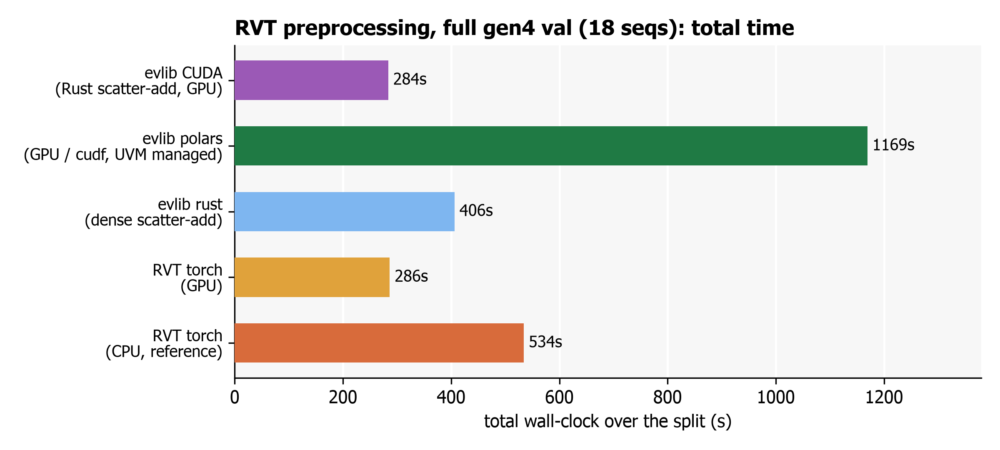
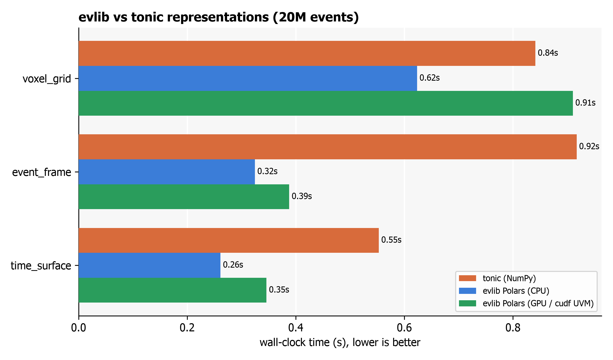

# Performance Guide

This guide describes evlib's benchmarked performance and explains when each execution backend wins. Two committed benchmark suites back these numbers: the RVT preprocessing pipeline (`benchmarks/bench_rvt_dataset.py`) and the representation comparison against tonic (`benchmarks/bench_tonic.py`).

## Architecture: query layer plus compute kernels

evlib splits work across two layers, and understanding the split explains the numbers below.

- **Query, filter and transform layer (Polars).** `load_events` returns a Polars LazyFrame, and filtering and representation building run as Polars expressions. This layer runs on the CPU, and on the cudf GPU engine (via `engine="gpu"`), which by default allocates through cudf-polars' own pooled memory resource, not CUDA managed memory (UVM). See [GPU memory footprint](#gpu-memory-footprint) below for measured VRAM use and when UVM is actually worth adding.
- **Compute layer (native scatter-add kernels).** The stacked-histogram for the RVT pipeline is built by dedicated kernels with four backends: Polars, a Rust dense scatter-add (CPU), a custom CUDA scatter-add kernel (NVIDIA GPU), and a Metal scatter-add kernel (Apple Silicon GPU). The native kernels are exposed as `evlib.representations_rs.stacked_histogram_dense`, `stacked_histogram_dense_cuda` and `stacked_histogram_dense_metal`.

Polars on the GPU is not a free speed-up for a single transfer-bound operation; the GPU win comes from the custom scatter-add kernels. For the RVT pipeline at scale the shared HDF5 read dominates the largest sequences, so the CUDA-versus-RVT-GPU result is parity-plus rather than a large multiplier.

## RVT preprocessing pipeline

`evlib.rvt.process_sequence(..., backend=...)` reproduces RVT's stacked-histogram preprocessing. The `backend` argument selects one of the four compute backends above (`"polars"`, `"rust"`, `"cuda"`, `"metal"`).

Validation run on the gen4_1mpx set (18 sequences, single pass) on an RTX 4090. Every output was asserted bit-identical to the RVT torch reference, except a roughly 1e-10 float-binning boundary quirk on three sequences.

| Pipeline | Total time (18 sequences) | Relative to RVT |
|----------|---------------------------|-----------------|
| evlib CUDA (custom kernel) | 283.6s | 1.01x faster than RVT torch-GPU (parity, edging ahead); 1.88x faster than RVT torch-CPU |
| RVT torch-GPU (reference) | 286.3s | baseline (GPU) |
| evlib Rust-CPU | 406.2s | 1.32x faster than RVT torch-CPU |
| RVT torch-CPU (reference) | 534.2s | baseline (CPU) |



The CUDA backend reaches parity-plus with RVT's own GPU pipeline because the shared HDF5 read dominates the large sequences; the Rust CPU backend is a clear 1.32x ahead of the RVT CPU reference. The companion peak-memory chart is `benchmarks/out/rvt_final_memory.png`.

## Representations versus tonic

For the general representation surface (voxel grid, event frame, time surface) the natural baseline is tonic (pure NumPy). The comparison feeds the same events (a 20M-event eTram stream) to both libraries.

| Representation | evlib Polars CPU | tonic (NumPy) | Speedup |
|----------------|------------------|---------------|---------|
| voxel_grid | 0.62s | 0.84s | 1.35x |
| event_frame | 0.32s | 0.92s | 2.9x |
| time_surface | 0.26s | 0.55s | 2.1x |



evlib's cudf GPU engine runs all three of these fully on the GPU, using cudf-polars' default allocator (no UVM needed at this scale). At this stream size the operations are transfer-bound, so CPU Polars is the fastest of the evlib paths; the GPU path still beats tonic on event_frame and time_surface. This is the practical illustration of the caveat above: pick the CPU Polars engine for single transfer-bound representation calls, and reach for the GPU when the workload is compute-heavy or larger than a single transfer.

## The Metal backend on Apple Silicon

The Metal backend was verified on an Apple M2 Pro. It compiles the MSL kernel at runtime and dispatches it on the actual Metal device, and its output is bit-identical to the CPU kernel (it bins with integer division, so there is no float32 precision caveat). On a realistic per-launch batch (5.1M events, 128 windows, 1280x720 downsampled to 640x360) the result was:

| Backend | Per-batch time (M2 Pro) | Matches CPU |
|---------|-------------------------|---------------|
| Rust dense scatter-add (CPU) | 94 ms | reference |
| Metal scatter-add (Apple GPU) | 281 ms | yes |

Metal is about 3x slower than the multi-threaded Rust CPU kernel on the M2 Pro. The kernel runs on the GPU (per-call setup is only about 5 ms once the shader is cached), but the workload is memory-bound: it allocates and reads back a large dense buffer, and the M2 Pro's integrated GPU loses that to the chip's fast CPU cores. The CUDA win on a discrete RTX 4090 does not transfer to an integrated Apple GPU.

Metal is therefore a portability path: an exact on-device match on Apple Silicon, where the torch-CUDA reference cannot run, but not a speed win on M2-class hardware. Use `backend="rust"` for the fastest path on an Apple machine. A larger Apple GPU (M-series Max or Ultra) may change the balance; that is unmeasured.

## Choosing an engine and backend

- **Representations on a single stream:** use the default CPU Polars engine (`engine="auto"`). It is the fastest evlib path for transfer-bound calls and beats tonic across voxel grid, event frame and time surface.
- **Representations that are compute-heavy or on the largest files:** use `engine="gpu"`. Its default cudf-polars allocator is enough for every evlib dataset tested to date; see [GPU memory footprint](#gpu-memory-footprint) below.
- **RVT preprocessing on NVIDIA hardware:** use `backend="cuda"` for parity-plus with the RVT torch-GPU reference.
- **RVT preprocessing on Apple Silicon:** use `backend="rust"` for the fastest path; `backend="metal"` runs the same computation on the Apple GPU with matching output but is slower on M2-class hardware (see above).
- **RVT preprocessing on CPU:** use `backend="rust"`, which is 1.32x faster than the RVT torch-CPU reference.

## GPU memory footprint

`engine="gpu"` maps straight to `pl.LazyFrame.collect(engine=engine)`; the default path allocates through cudf-polars' own memory resource, not CUDA managed memory (UVM). Correctness was checked on an RTX 4090: GPU and CPU `.collect()` give numerically identical results on a small file (slider_depth, about 53k rows) and on the largest real file available, `events_gpu_torch.h5` (62,961,273 events, 818.5MB raw). evlib's on-wire schema is exactly 13 bytes per event (`x`: Int16, `y`: Int16, `t`: Duration(us) as i64, `polarity`: Int8), confirmed empirically: 818.5MB / 62,961,273 events = 13.00 bytes/event exactly.

Peak GPU memory for a realistic query, `filter_by_polarity` followed by `create_stacked_histogram`, on that 818.5MB/62.96M-event file measured about 3GB peak: roughly 3.7x the raw data size, well inside the RTX 4090's 24GB of VRAM.

At that overhead, reaching the 24GB card limit from evlib's own workload needs roughly 500M+ events in a single query. The largest real file available is about 8x smaller than that. Even eTram, the largest dataset evlib's own docs mention (up to 1.6GB raw, about 123M events), is still about 4x smaller than that threshold and would use only about 6GB peak VRAM. No realistic evlib dataset needs UVM.

### If a workload, or a co-tenant on your GPU, exceeds VRAM

UVM still has a real use: not for evlib's own data sizes, but for a genuinely huge future dataset, or a shared GPU where another process has already claimed most of the VRAM. The second case happened during this testing: a concurrent unrelated job was using about 20.5GB of the 24GB card, leaving the default GPU path only about 3.5GB of real headroom.

Both cases were tested directly. Without UVM, evlib-shaped GPU queries above available headroom either fail with a CUDA out-of-memory error, or degrade badly: 100%+ GPU utilisation and a stall of 4 or more minutes with no result, observed at about 503M events. `rmm.mr.ManagedMemoryResource()` (basic UVM) and a pooled-plus-prefetch variant both succeeded at every tested size; the pooled-plus-prefetch variant was 1.46-1.75x faster than basic UVM.

```python notest
import polars as pl
import rmm
import rmm.mr as mr

# Basic UVM: works, but pages fault frequently (measured 1.46-1.75x slower
# than the pooled+prefetch variant below).
managed = mr.ManagedMemoryResource()
mr.set_current_device_resource(managed)
engine = pl.GPUEngine(memory_resource=managed)

# Recommended: pooled allocation on top of managed memory, with prefetch
# hints to the CUDA driver, to reduce page-fault overhead.
managed = mr.ManagedMemoryResource()
pool = mr.PoolMemoryResource(managed)
prefetch = mr.PrefetchResourceAdaptor(pool)
mr.set_current_device_resource(prefetch)
engine = pl.GPUEngine(memory_resource=prefetch)

result = lazy_frame.collect(engine=engine)
```

## Working with loaded events

`load_events` returns a Polars LazyFrame. The schema is `t` as a Duration (microseconds), `x` and `y` as Int16, and `polarity` as Int8 (-1 or +1).

```python
import evlib

events = evlib.load_events("data/slider_depth/events.txt")
df = events.collect()
print(f"Loaded {len(df):,} events")
print(df.schema)
```

### Filter during loading

Apply filters as Polars expressions on the LazyFrame, or use the helpers in `evlib.filtering`, so the work stays lazy and GPU-collectable.

```python
import evlib
import evlib.filtering as evf

events = evlib.load_events("data/slider_depth/events.txt")
positive = evf.filter_by_polarity(events, polarity=1)
df = positive.collect()
print(f"Filtered to {len(df):,} positive events")
```

### Build a representation

```python
import evlib
import evlib.representations as evr

events = evlib.load_events("data/slider_depth/events.txt")
voxel = evr.create_voxel_grid(events, height=480, width=640, n_time_bins=5)
print(f"Voxel grid entries: {len(voxel)}")
```

## Running the benchmarks

```bash
# RVT pipeline across a dataset split (evlib GPU/CPU/Rust vs RVT GPU/CPU)
python -m benchmarks.bench_rvt_dataset \
    --orig-root ~/datasets/gen4_1mpx_original/val \
    --ref-root  ~/datasets/gen4_1mpx_processed_RVT/gen4/val \
    --backends evlib_gpu evlib_cpu evlib_rust rvt_gpu rvt_cpu

# Representations vs tonic on one real stream
python -m benchmarks.bench_tonic \
    --raw ~/datasets/eTram/raw/test_1/test_day_001.raw \
    --n-events 30000000
```

Both harnesses run each measurement in a fresh subprocess so peak resident memory is an unambiguous per-process figure, and the RVT harness asserts every output matches the reference exactly before keeping its timing.
