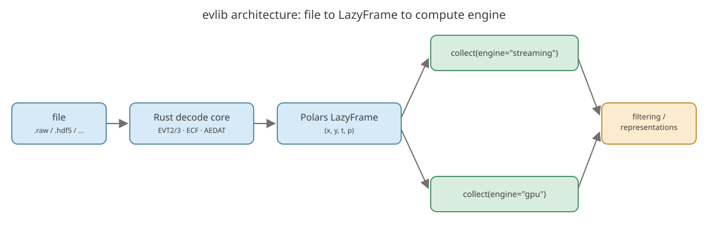
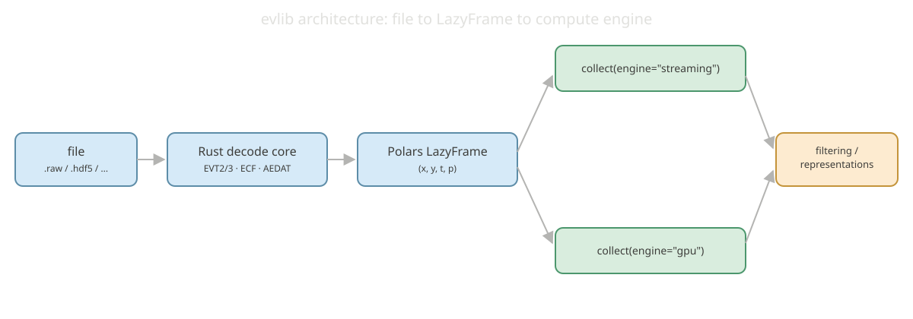
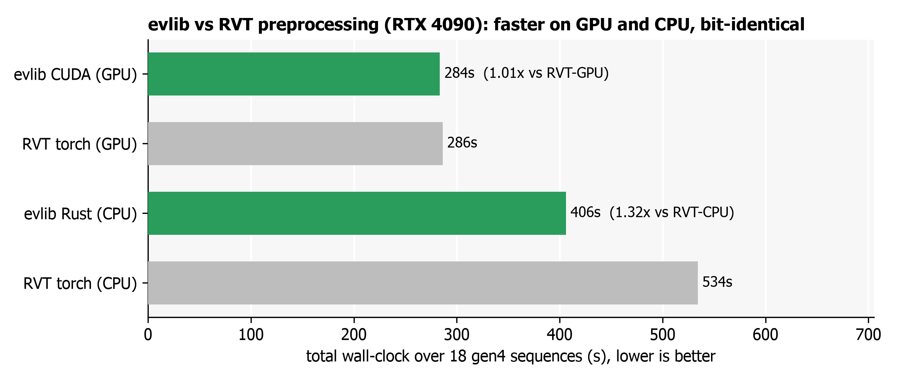

<table align="center">
  <tr>
    <td>
      
    </td>
    <td>
      <h1 style="margin: 0;">
        <code>evlib</code>: Event Camera Data Processing Library
      </h1>
    </td>
  </tr>
</table>

<div style="text-align: center;" align="center">

[](https://pypi.org/project/evlib/)
[](https://pypi.org/project/evlib/)
[](https://tallamjr.github.io/evlib/)
[](https://github.com/tallamjr/evlib/actions/workflows/pytest.yml)
[](https://github.com/tallamjr/evlib/actions/workflows/rust.yml)
[](https://github.com/tallamjr/evlib)
[](https://github.com/tallamjr/evlib/blob/master/LICENSE.md)

</div>

evlib is an event camera processing library with a Rust backend and Python
bindings, built for scalable processing of real-world event camera datasets.
It keeps a thin Rust core for binary format decoding and native compute
kernels, and does all DataFrame work in Polars from Python, so the same lazy
query runs on the CPU streaming engine or, unchanged, on the GPU via
cudf-polars.

<p align="center">
  
  
</p>

## Why evlib

- **Universal format support**: EVT2/3, HDF5 (with the Prophesee ECF codec), AEDAT, AER, and text. Format detection is automatic. EVT2 decode is checked byte-identical to the OpenEB reference decoder by a committed-digest conformance gate.
- **Polars DataFrame integration**: `load_events` returns a lazy `LazyFrame`; filtering and representation building are Polars expressions that collect on the CPU streaming engine or, unchanged, on the GPU via cudf-polars.
- **RVT-identical preprocessing**: `evlib.rvt.process_sequence` reproduces RVT's stacked-histogram pipeline across four backends (`polars`, `rust`, `cuda`, `metal`), bit-validated against RVT's own torch preprocessing.
- **Deep learning models**: E2VID and RVT (`evlib.models`), with pretrained weight loading, PyTorch datasets (`evlib.data`), and Prophesee-compatible detection evaluation (`evlib.eval`).
- **Real-world scale**: tested against files up to 1.6GB with an exact, empirically confirmed 13 bytes/event on-wire layout.

## Explore the docs

<div class="grid cards" markdown>

-   __Getting Started__

    ---

    Install evlib and load your first event file in five minutes.

    [Quick Start](getting-started/quickstart.md)

-   __User Guide__

    ---

    Loading, formats, filtering, representations, and Polars preprocessing.

    [Loading Data](user-guide/loading-data.md)

-   __RVT Pipeline__

    ---

    RVT-identical stacked-histogram preprocessing across four backends, plus OpenEB conformance.

    [RVT Overview](rvt/index.md)

-   __Models & Training__

    ---

    E2VID and RVT models, PyTorch datasets, and detection evaluation.

    [Models Overview](models/index.md)

-   __API Reference__

    ---

    Full reference for core, formats, filtering, representations, processing, and data loading.

    [API Core](api/core.md)

</div>

## A worked example

```python
import evlib

# Automatic format detection: returns a Polars LazyFrame
events = evlib.load_events("data/prophesee/samples/evt2/80_balls.raw")

df = events.collect(engine="streaming")
print(f"Loaded {len(df):,} events")
print(f"Resolution: {df['x'].max()} x {df['y'].max()}")
print(f"Duration:   {df['t'].max() - df['t'].min()}")
```

<!-- evlib:output -->
<!-- evlib:output:start -->
```text
Loaded 4,588,809 events
Resolution: 639 x 479
Duration:   0:00:06.284008
```
<!-- evlib:output:end -->

See the [Quick Start](getting-started/quickstart.md) guide for filtering and
representation examples that build on this.

## Performance

evlib is bit-validated against RVT (PyTorch), tonic, OpenEB, and dv_processing.
On the gen4_1mpx validation set (18 sequences, RTX 4090), RVT preprocessing
matches RVT torch exactly bar a single roughly 1e-10 boundary quirk, and
evlib's CUDA backend reaches parity-plus with RVT's own torch-GPU pipeline
while its Rust CPU backend is 1.32x faster than RVT's torch-CPU reference.

<figure markdown>
  
  <figcaption>evlib vs RVT preprocessing on an RTX 4090: evlib is faster than RVT on both GPU and CPU, with matching output</figcaption>
</figure>

See the [Performance Guide](getting-started/performance.md) and
[RVT Pipeline](rvt/index.md) pages for the full benchmark set, including the
representations-versus-tonic comparison and GPU memory footprint.

## Installation

```bash
pip install evlib
```

Polars is a hard dependency, so no extra install step is needed for DataFrame
support. For PyTorch model support, `pip install evlib[torch]`. See the
[Installation guide](getting-started/installation.md) for source builds,
system dependencies, and platform-specific HDF5 notes.

## Development and support

```bash
pytest                        # Python test suite
cargo test                    # Rust test suite
pytest --markdown-docs docs/  # documentation examples
```

See the [Contributing guide](development/contributing.md) for the full
development workflow. Report bugs and request features on
[GitHub Issues](https://github.com/tallamjr/evlib/issues).

## License

MIT License, see [LICENSE.md](https://github.com/tallamjr/evlib/blob/master/LICENSE.md) for details.
