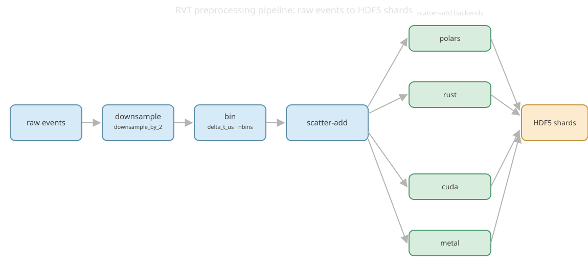

# RVT Preprocessing Pipeline

`evlib.rvt.process_sequence(...)` reproduces the RVT (Recurrent Vision Transformer) stacked-histogram preprocessing pipeline: it takes a raw event sequence and writes the same on-disk layout that RVT's own preprocessing produces, so a model trained against RVT's data can consume evlib's output directly.

<p align="center">
  
  
</p>

The pipeline has four stages: downsample (optional 2x spatial downsample, `downsample_by_2`), bin (assign events to `nbins` temporal bins per window of `delta_t_us` microseconds), scatter-add (accumulate binned events into a dense tensor), and write (HDF5 shards under `event_representations_v2/`). The scatter-add step is where the four backends differ; everything else is shared.

## The four backends

`process_sequence(..., backend=...)` selects between four interchangeable scatter-add implementations:

- `"polars"`: the Polars query layer, on the CPU or on the cudf GPU engine when you pass `engine="gpu"` or a `pl.GPUEngine(...)`. This is the default.
- `"rust"`: a Rust dense scatter-add kernel, CPU only.
- `"cuda"`: a custom CUDA scatter-add kernel on an NVIDIA GPU. It is built with `nvcc` into `librvt_scatter.so` and loaded at runtime via `libloading`, located through the `EVLIB_CUDA_LIB` environment variable.
- `"metal"`: a Metal/MSL scatter-add kernel for Apple Silicon, via `metal-rs`.

The native kernels behind `"rust"`, `"cuda"` and `"metal"` are also exposed directly as `evlib.representations_rs.stacked_histogram_dense`, `stacked_histogram_dense_cuda`, and `stacked_histogram_dense_metal`.

```python notest
from pathlib import Path
import numpy as np
from evlib.rvt import process_sequence

# ev_repr_timestamps_us is the RVT representation grid (window end times, us);
# it normally comes from evlib.data.label_preprocess.build_objframes_and_grid.
grid = np.load("ev_repr_timestamps_us.npy")

process_sequence(
    in_h5=Path("gen4_1mpx_original/val/some_sequence/some_sequence_td.h5"),
    out_dir=Path("out/some_sequence"),
    dataset="gen4",
    height=720,
    width=1280,
    ev_repr_timestamps_us=grid,
    downsample_by_2=True,
    backend="rust",       # "polars" | "rust" | "cuda" | "metal"
    engine="auto",        # only used by backend="polars"
)
```

This example needs a raw gen4-format sequence (`.h5` with `/events/{t,x,y,p}`), which is not part of the tracked fixtures, so it is illustrative rather than runnable here.

## Building the GPU backends

`"polars"` and `"rust"` are always available. `"cuda"` and `"metal"` are opt-in Cargo features that need a build step:

```bash
# CUDA (NVIDIA, Linux-oriented): build the kernel source (lib/rvt_scatter.cu) into a
# shared library with nvcc, point EVLIB_CUDA_LIB at it, then build evlib with the
# cuda Cargo feature.
export EVLIB_CUDA_LIB=/absolute/path/to/librvt_scatter.so
maturin develop --features cuda

# Metal (Apple Silicon): build with the metal Cargo feature.
CC=clang maturin develop --features metal
```

Without either build step, `backend="cuda"` and `backend="metal"` are unavailable and only `"polars"` and `"rust"` can be selected.

## Metal is a portability path, not a speed path

The Metal backend was verified on an Apple M2 Pro. Its output is bit-identical to the CPU Rust kernel (binning uses integer division, so there is no float32 precision caveat), but on a realistic per-launch batch (5.1M events, 128 windows, 1280x720 downsampled to 640x360) it measured about 3x slower than the CPU kernel:

| Backend | Per-batch time (M2 Pro) | Matches CPU |
|---------|--------------------------|--------------|
| Rust dense scatter-add (CPU) | 94 ms | reference |
| Metal scatter-add (Apple GPU) | 281 ms | yes |

The Metal kernel does run on the GPU (per-call setup is only about 5 ms once the shader is cached), but the workload is memory-bound: it allocates and reads back a large dense buffer, and the M2 Pro's integrated GPU loses that exchange to the chip's fast CPU cores. The CUDA win on a discrete RTX 4090 does not transfer to an integrated Apple GPU. Metal is therefore useful as a portability path, an exact on-device match on Apple Silicon where the CUDA/torch-CUDA reference cannot run, rather than a speed win on M2-class hardware. Use `backend="rust"` for the fastest path on an Apple machine.

## Choosing a backend

- **NVIDIA GPU:** `backend="cuda"` reaches parity-plus with RVT's own torch-GPU pipeline (see the benchmark table below).
- **Apple Silicon:** `backend="rust"` is the fastest path; `backend="metal"` runs the same computation on the Apple GPU with matching output but is about 3x slower on M2-class hardware.
- **CPU, no GPU:** `backend="rust"` is 1.32x faster than the RVT torch-CPU reference.
- **No native build available:** `backend="polars"` always works, CPU or cudf-GPU, and needs no Cargo feature.

## Measured performance

Validation ran on the gen4_1mpx set (18 sequences, single pass) on an RTX 4090. Every output was asserted bit-identical to the RVT torch reference, except a roughly 1e-10 float-binning boundary quirk on three sequences.

| Pipeline | Total time (18 sequences) | Relative to RVT |
|----------|---------------------------|-----------------|
| evlib CUDA (custom kernel) | 283.6s | 1.01x faster than RVT torch-GPU (parity, edging ahead); 1.88x faster than RVT torch-CPU |
| RVT torch-GPU (reference) | 286.3s | baseline (GPU) |
| evlib Rust-CPU | 406.2s | 1.32x faster than RVT torch-CPU |
| RVT torch-CPU (reference) | 534.2s | baseline (CPU) |

Full plots: `benchmarks/out/rvt_final_time.png` (wall-clock across all five backends) and `benchmarks/out/rvt_final_memory.png` (peak resident memory). Both are generated by `benchmarks/bench_rvt_dataset.py`; see the [Performance Guide](../getting-started/performance.md#rvt-preprocessing-pipeline) for how to run it and for the standalone-representations-versus-tonic numbers.

The CUDA backend reaches parity-plus with RVT's own GPU pipeline because the shared HDF5 read dominates the largest sequences; the Rust CPU backend is a clear 1.32x ahead of the RVT CPU reference.

## Verifying output correctness

evlib's decode and preprocessing are checked against reference implementations at two levels: the RVT stacked-histogram output is asserted bit-identical (bar the 1e-10 boundary quirk above) against RVT's own torch preprocessing during the benchmark run, and the underlying EVT2/EVT3 event decode is checked against the OpenEB reference decoders by a dedicated conformance harness. See [OpenEB Conformance](conformance.md) for how that harness works.
