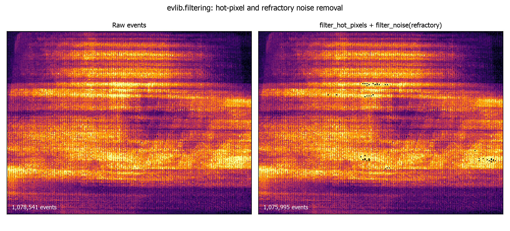

# Event Filtering

Raw event streams carry sensor noise, hot pixels and regions or time ranges
you do not need. `evlib.filtering` provides lazy, Polars-based filters for
each of these problems, plus a `preprocess_events` pipeline that runs them in
one call.

## Overview

Every function in the module takes a Polars LazyFrame or DataFrame (the
result of `evlib.load_events`) and returns a LazyFrame. Nothing is computed
until you call `.collect()`, so filters chain together into a single query
plan and can run on the CPU, the streaming engine, or the cudf GPU engine via
the `engine` argument.

```python
import evlib
import evlib.filtering as evf

events = evlib.load_events("data/slider_depth/events.txt")
print(f"Loaded {len(events.collect()):,} events")

# Keep only the first second, then only positive-polarity events.
# Chaining stays lazy until the final .collect().
filtered = evf.filter_by_time(events, t_start=0.0, t_end=1.0)
filtered = evf.filter_by_polarity(filtered, polarity=1)
print(f"After filtering: {len(filtered.collect()):,} events")
```

<!-- evlib:output -->
<!-- evlib:output:start -->
```text
Loaded 1,078,541 events
After filtering: 125,930 events
```
<!-- evlib:output:end -->

The `slider_depth` text file encodes polarity as 0/1 (0 for negative, 1 for
positive), not -1/1. Check `df["polarity"].unique()` on data you have not
seen before, since the encoding varies between sources.

## filter_by_time

`filter_by_time(events, t_start=None, t_end=None, engine="auto")` keeps
events whose timestamp falls in `[t_start, t_end]`, given in seconds.
Either bound can be `None` to leave that side open. Internally the seconds
are converted to microseconds to compare against the `t` Duration column, so
you never have to do that conversion yourself.

```python
import evlib
import evlib.filtering as evf

events = evlib.load_events("data/slider_depth/events.txt")

# Events between 0.1s and 0.5s
windowed = evf.filter_by_time(events, t_start=0.1, t_end=0.5)
print(f"Events in [0.1s, 0.5s]: {len(windowed.collect()):,}")

# Open-ended: everything from 3.0s onward
tail = evf.filter_by_time(events, t_start=3.0)
print(f"Events from 3.0s onward: {len(tail.collect()):,}")
```

## filter_by_roi

`filter_by_roi(events, x_min, x_max, y_min, y_max, engine="auto")` keeps
events whose `x` and `y` both fall inside the given bounds, inclusive on
both ends. `slider_depth` is a 240x180 sensor, so a centred region of
interest looks like this:

```python
import evlib
import evlib.filtering as evf

events = evlib.load_events("data/slider_depth/events.txt")

roi = evf.filter_by_roi(events, x_min=50, x_max=180, y_min=40, y_max=140)
print(f"Events in ROI: {len(roi.collect()):,}")
```

Passing `x_min > x_max` or `y_min > y_max` raises `ValueError` immediately,
rather than silently returning zero rows.

## filter_by_polarity

`filter_by_polarity(events, polarity, engine="auto")` keeps events whose
`polarity` column matches the given value, or any value in a list. The
values to pass depend on how the source data encodes polarity: `slider_depth`
uses 0/1, other sources may use -1/1.

```python
import evlib
import evlib.filtering as evf

events = evlib.load_events("data/slider_depth/events.txt")

positive = evf.filter_by_polarity(events, polarity=1)
negative = evf.filter_by_polarity(events, polarity=0)
print(f"Positive: {len(positive.collect()):,}, negative: {len(negative.collect()):,}")

# A list keeps events matching any of the given values.
both = evf.filter_by_polarity(events, polarity=[0, 1])
print(f"Both polarities: {len(both.collect()):,}")
```

## filter_hot_pixels

Some pixels fire far more often than their neighbours because of sensor
defects rather than real scene motion. `filter_hot_pixels(events,
threshold_percentile=None, engine="auto")` counts events per `(x, y)`
coordinate, then drops every event at a coordinate whose count exceeds the
given percentile of the per-pixel count distribution. The default threshold
is the 99.9th percentile.

```python
import evlib
import evlib.filtering as evf

events = evlib.load_events("data/slider_depth/events.txt")

before = len(events.collect())
cleaned = evf.filter_hot_pixels(events, threshold_percentile=99.9)
after = len(cleaned.collect())
print(f"Removed {before - after:,} events from hot pixels ({before:,} -> {after:,})")
```

A lower `threshold_percentile` (for example 95.0) removes more pixels and is
more aggressive.

## filter_noise

`filter_noise(events, method=None, refractory_period_us=None,
engine="auto")` implements refractory-period denoising: at each pixel, an
event is dropped if it arrives within `refractory_period_us` microseconds of
the previous event at that same pixel. `"refractory"` is the only
implemented method, and is used by default. The default period is 1000us
(1ms), which barely touches `slider_depth`; a longer period makes the effect
visible.

```python
import evlib
import evlib.filtering as evf

events = evlib.load_events("data/slider_depth/events.txt")

before = len(events.collect())
denoised = evf.filter_noise(events, method="refractory", refractory_period_us=10_000)
after = len(denoised.collect())
print(f"Removed {before - after:,} events within a 10ms refractory period")
```

<!-- evlib:output -->
<!-- evlib:output:start -->
```text
Removed 218,294 events within a 10ms refractory period
```
<!-- evlib:output:end -->

`filter_noise` sorts by `t` internally, so you do not need to pre-sort the
input (`evlib.load_events` already sorts by default).

The figure below shows both filters applied together: a per-pixel event-count
heatmap of the raw stream (left, hot pixels visible as bright points) next to
the same window after `filter_hot_pixels` and `filter_noise(method="refractory")`
(right).



## filter_multiple_rois

`filter_multiple_rois(events, rois, engine="auto")` is the multi-region form
of `filter_by_roi`: it keeps events that fall inside *any* of a list of
`(x_min, x_max, y_min, y_max)` tuples, combined with logical OR.

```python
import evlib
import evlib.filtering as evf

events = evlib.load_events("data/slider_depth/events.txt")

rois = [
    (0, 100, 0, 90),      # top-left quadrant
    (140, 239, 90, 179),  # bottom-right quadrant
]
corners = evf.filter_multiple_rois(events, rois=rois)
print(f"Events in either ROI: {len(corners.collect()):,}")
```

## preprocess_events

`preprocess_events` combines the filters above into a single preprocessing
pipeline, applied in a fixed order chosen for performance: time, then ROI,
then polarity, then hot-pixel removal, then noise filtering. Every stage is
optional and controlled by its own arguments.

```python
import evlib
import evlib.filtering as evf

events = evlib.load_events("data/slider_depth/events.txt")

processed = evf.preprocess_events(
    events,
    t_start=0.1, t_end=1.0,
    roi=(0, 239, 0, 179),
    polarity=1,
    remove_hot_pixels=True,
    hot_pixel_threshold=99.9,
    denoise=True,
    refractory_period_us=1000.0,
)
print(f"Preprocessed: {len(processed.collect()):,} events")
```

<!-- evlib:output -->
<!-- evlib:output:start -->
```text
Preprocessed: 115,113 events
```
<!-- evlib:output:end -->

The filtering order matters: time and ROI filters run first because they cut
down the row count cheaply, before the more expensive hot-pixel and noise
stages run on a smaller frame.

## Choosing an engine

Every function accepts an `engine` argument: `"auto"` (default), `"streaming"`
for large files that do not fit comfortably in memory, or `"gpu"` (or a
`pl.GPUEngine(...)`) to run on cudf-polars where CUDA is available. The
argument only affects how Polars plans the eventual `.collect()`; the filter
itself stays lazy either way, so you can freely chain functions with
different engine hints and only the final collect matters.

```python
import evlib
import evlib.filtering as evf

events = evlib.load_events("data/slider_depth/events.txt")
filtered = evf.filter_by_time(events, t_start=0.0, t_end=1.0, engine="streaming")
df = filtered.collect(engine="streaming")
print(f"Streaming collect: {len(df):,} events")
```

## Next steps

- [Filtering API Reference](../api/filtering.md) for the full parameter reference.
- [Event Representations](representations.md) to convert filtered events into dense tensors.
- [Polars-Based Event Preprocessing](polars-preprocessing.md) for writing custom filters as raw Polars expressions.
